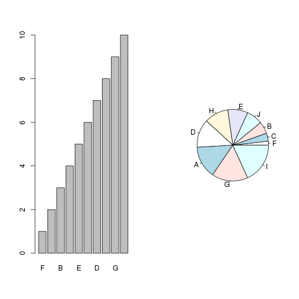
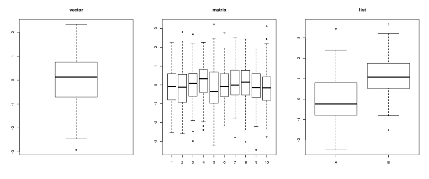
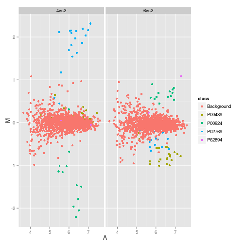

> ## Objectives {.objectives}
>
> * Learn base graphics plotting function
> * Learn some basic customisation
> * Other plotting frameworks: `ggplot2` and `lattice`
> * Save plot(s) in a pdf file.


# Motivations


Anscombe's quartet are four x-y datasets which have the same
traditional statistical properties (mean, variance, correlation,
regression line, etc.), yet are very different. These difference
become clear when the data are visualised.

<table>
 <thead>
  <tr>
   <th style="text-align:right;"> x1 </th>
   <th style="text-align:right;"> x2 </th>
   <th style="text-align:right;"> x3 </th>
   <th style="text-align:right;"> x4 </th>
   <th style="text-align:right;"> y1 </th>
   <th style="text-align:right;"> y2 </th>
   <th style="text-align:right;"> y3 </th>
   <th style="text-align:right;"> y4 </th>
  </tr>
 </thead>
<tbody>
  <tr>
   <td style="text-align:right;"> 10 </td>
   <td style="text-align:right;"> 10 </td>
   <td style="text-align:right;"> 10 </td>
   <td style="text-align:right;"> 8 </td>
   <td style="text-align:right;"> 8.04 </td>
   <td style="text-align:right;"> 9.14 </td>
   <td style="text-align:right;"> 7.46 </td>
   <td style="text-align:right;"> 6.58 </td>
  </tr>
  <tr>
   <td style="text-align:right;"> 8 </td>
   <td style="text-align:right;"> 8 </td>
   <td style="text-align:right;"> 8 </td>
   <td style="text-align:right;"> 8 </td>
   <td style="text-align:right;"> 6.95 </td>
   <td style="text-align:right;"> 8.14 </td>
   <td style="text-align:right;"> 6.77 </td>
   <td style="text-align:right;"> 5.76 </td>
  </tr>
  <tr>
   <td style="text-align:right;"> 13 </td>
   <td style="text-align:right;"> 13 </td>
   <td style="text-align:right;"> 13 </td>
   <td style="text-align:right;"> 8 </td>
   <td style="text-align:right;"> 7.58 </td>
   <td style="text-align:right;"> 8.74 </td>
   <td style="text-align:right;"> 12.74 </td>
   <td style="text-align:right;"> 7.71 </td>
  </tr>
  <tr>
   <td style="text-align:right;"> 9 </td>
   <td style="text-align:right;"> 9 </td>
   <td style="text-align:right;"> 9 </td>
   <td style="text-align:right;"> 8 </td>
   <td style="text-align:right;"> 8.81 </td>
   <td style="text-align:right;"> 8.77 </td>
   <td style="text-align:right;"> 7.11 </td>
   <td style="text-align:right;"> 8.84 </td>
  </tr>
  <tr>
   <td style="text-align:right;"> 11 </td>
   <td style="text-align:right;"> 11 </td>
   <td style="text-align:right;"> 11 </td>
   <td style="text-align:right;"> 8 </td>
   <td style="text-align:right;"> 8.33 </td>
   <td style="text-align:right;"> 9.26 </td>
   <td style="text-align:right;"> 7.81 </td>
   <td style="text-align:right;"> 8.47 </td>
  </tr>
  <tr>
   <td style="text-align:right;"> 14 </td>
   <td style="text-align:right;"> 14 </td>
   <td style="text-align:right;"> 14 </td>
   <td style="text-align:right;"> 8 </td>
   <td style="text-align:right;"> 9.96 </td>
   <td style="text-align:right;"> 8.10 </td>
   <td style="text-align:right;"> 8.84 </td>
   <td style="text-align:right;"> 7.04 </td>
  </tr>
  <tr>
   <td style="text-align:right;"> 6 </td>
   <td style="text-align:right;"> 6 </td>
   <td style="text-align:right;"> 6 </td>
   <td style="text-align:right;"> 8 </td>
   <td style="text-align:right;"> 7.24 </td>
   <td style="text-align:right;"> 6.13 </td>
   <td style="text-align:right;"> 6.08 </td>
   <td style="text-align:right;"> 5.25 </td>
  </tr>
  <tr>
   <td style="text-align:right;"> 4 </td>
   <td style="text-align:right;"> 4 </td>
   <td style="text-align:right;"> 4 </td>
   <td style="text-align:right;"> 19 </td>
   <td style="text-align:right;"> 4.26 </td>
   <td style="text-align:right;"> 3.10 </td>
   <td style="text-align:right;"> 5.39 </td>
   <td style="text-align:right;"> 12.50 </td>
  </tr>
  <tr>
   <td style="text-align:right;"> 12 </td>
   <td style="text-align:right;"> 12 </td>
   <td style="text-align:right;"> 12 </td>
   <td style="text-align:right;"> 8 </td>
   <td style="text-align:right;"> 10.84 </td>
   <td style="text-align:right;"> 9.13 </td>
   <td style="text-align:right;"> 8.15 </td>
   <td style="text-align:right;"> 5.56 </td>
  </tr>
  <tr>
   <td style="text-align:right;"> 7 </td>
   <td style="text-align:right;"> 7 </td>
   <td style="text-align:right;"> 7 </td>
   <td style="text-align:right;"> 8 </td>
   <td style="text-align:right;"> 4.82 </td>
   <td style="text-align:right;"> 7.26 </td>
   <td style="text-align:right;"> 6.42 </td>
   <td style="text-align:right;"> 7.91 </td>
  </tr>
  <tr>
   <td style="text-align:right;"> 5 </td>
   <td style="text-align:right;"> 5 </td>
   <td style="text-align:right;"> 5 </td>
   <td style="text-align:right;"> 8 </td>
   <td style="text-align:right;"> 5.68 </td>
   <td style="text-align:right;"> 4.74 </td>
   <td style="text-align:right;"> 5.73 </td>
   <td style="text-align:right;"> 6.89 </td>
  </tr>
</tbody>
</table>


|         |          1|          2|          3|          4|
|:--------|----------:|----------:|----------:|----------:|
|var(x)   | 11.0000000| 11.0000000| 11.0000000| 11.0000000|
|mean(x)  |  9.0000000|  9.0000000|  9.0000000|  9.0000000|
|var(y)   |  4.1272691|  4.1276291|  4.1226200|  4.1232491|
|mean(y)  |  7.5009091|  7.5009091|  7.5000000|  7.5009091|
|cor(x,y) |  0.8164205|  0.8162365|  0.8162867|  0.8165214|

 

The goal of visualisation is to **explore** the data to identify
**unexpected** patterns. R is particularly well suited because if
offers

* high-level plotting functions that produce useful figures with
  minimal efforts and enables

* flexibility and customisation to produce specialised/customized
  figures

# Base plotting

**Painters model**: Graphical elements are added to the canvas one
  layer at a time, and the picture builds up in levels. Lower levels
  are obscured by higher levels, allowing for blending, masking and
  overlaying of objects.


```r
plot(1:10, 1:10)
rect(2, 2, 8, 8, col = "black")
rect(3, 3, 7, 7, col = "white")
abline(0, 1, col = "red")
```

 

## High level plotting functions

High level plotting functions produce an appropriate chart based on the input.

### Scatter plots

`plot` is the generic plotting function. By default produces scatter
plots but other types can be set.


```r
  plot(x, y = NULL, type = "p",  xlim = NULL, ylim = NULL,
       log = "", main = NULL, sub = NULL, xlab = NULL, ylab = NULL,
       col = "black", cex = 1, pch = 1, ...)
```


```r
par(mfrow = c(2, 2))
plot(1:10, type = "p", main = "points (default)")
plot(1:10, type = "l", main = "lines")
plot(1:10, 10:1, type = "b", main = "both (points and lines)")
plot(1:10, type = "h", main = "histogram")
```

 

Setting colours and point character


```r
plot(1:10, col = c("red", "blue"),
     pch = c(15, 19), cex = 2,
     main = "points (default)")
```

 

> ## Challenge {.challenge}
> 1. Reproduce the figures above. Then customize the last figure so
>    that even points are discribed with plus and odd points with an
>    empty diamond. All plotting symbols should be of colour
>    `"steelblue"`. See `?points` for details about plotting
>    characters. Then, set the title of your plot using either `main`
>    as argument to `plot` (as above) or with the `title` function.
> 2. Load the `madata` data set from the `data/madata.rda` file. This
>    data represents quantitative proteomics data. Inspect the data:
>    how many rows and columns, what class is `madata`? Produce an
>    MA-plot, i.e the log2 fold-change as a function of the average
>    expression intensity using the `plot` function.


### Distributions


```r
m <- matrix(rnorm(1000), ncol = 10)
colnames(m) <- LETTERS[1:10]
par(mfrow = c(1, 2))
hist(m[, 1], main  = "histogram of A")
boxplot(m)
```

 

> ## Challenge {.challenge}
>
> In the previous sections, you used produced figures describing the
> average, max and min inflammation over time. Use a `boxplot` to
> represent the distributions of time.

### Counts


```r
x <- sample(10)
names(x) <- LETTERS[1:10]
par(mfrow = c(1, 2))
barplot(x)
abline(h = 6)
dotchart(x)
abline(v = 6, col = "red")
```

 

> ## Tip  {.callout}
>
> There is also a `pie` function to produce pie charts, which is
> however not recommended, as areas are much more difficult to compare
> that heights. Contrast the following bar and pie charts:
>
>  

### Heatmap


```r
heatmap(m)
```

 

> ## Challenge {.challenge}
>
> Produce a heatmap of the `inflammation-01.csv` data. If you
> encounter an error, check the `heatmap` documentation (`?heatmap`)
> and verify what kind of variable the function supports. Compare it
> with the class the your inflammation data. There are various `as.*`
> functions that enable to convert one data type in another (when
> possible at all). In the r console, type `as.` followed by `TAB` to
> use autocompletion and identify a suitable conversion function.

### These functions are methods

These high-level functions have customised behaviour that depends on their inputs:

* A `boxplot` of a `vector`, `a matrix` or a `list`:


```r
par(mfrow = c(1, 3))
boxplot(rnorm(100), main = "vector")
m <- matrix(rnorm(1000), ncol = 10)
boxplot(m, main = "matrix")
ll <- list(A = rnorm(100), B = rnorm(100, 1))
boxplot(ll, main = "list")
```

 

* A `plot` of 1 of 2 `vector`s of a `data.frame`:


```r
par(mfrow = c(1, 3))
x <- rnorm(100)
plot(x, main = "vector")
y <- rnorm(100)
plot(x, y, main = "2 vectors")
dfr <- data.frame(x, y)
plot(dfr, main = "data.frame")
```

 

## Low level interaction

Low level interaction with the drawing device to build up a figure piece by piece.

```
    points, lines, rect, arrows, axis, abline, ...
```

> ## Tip {.callout}
>
> The `colours()` function returns a vector of `length(colours())`
> colour names. One can also use one of the pre-defined colour
> palettes: `rainbow(n)`, `heat.colors(n)`, `terrain.colours(n)`,
> `topo.colors(n)`, `cm.colors(n)`, where `n` defined the number of
> colours. The `RColorBrewer` package offers well characterised
> palettes; see for example
>
> 
> ```r
> library("RColorBrewer")
> display.brewer.all()
> ```
> 
>  

# `ggplot2`

We need to install and load the package first.


```r
install.packages("ggplot2")
library("ggplots")
```

Based on the Grammar of Graphics

*  A plot is made up of multiple layers
* A layer consists of data (must be a data.frame), a set of mappings
   between variables and aesthetics (aes), a geometric object (geom)
   and a statistical transformation
*  Scales control the details of the mapping
*  All components are independent and reusable


```r
load("./data/madata.rda")
ggplot(data = madata, aes(x = A, y = M, colour = class)) +
    geom_point()
```

 


```r
load("./data/madata2.rda")
head(madata2)
```

```
##           A            M data protein      class
## 2  7.046010 -0.031266127 4vs2 ECA0625 Background
## 5  7.090470 -0.020368859 4vs2 ECA0625 Background
## 6  6.108037 -0.088470638 4vs2 ECA0625 Background
## 8  6.764458  0.155656421 4vs2 ECA0625 Background
## 10 7.275194  0.144162890 4vs2 ECA0625 Background
## 11 7.011953 -0.005855139 4vs2 ECA0625 Background
```

```r
tail(madata2)
```

```
##              A             M data protein      class
## 23061 4.748683 -0.1696683555 6vs2 ECA2541 Background
## 23091 5.576012  0.0004449593 6vs2 ECA4517 Background
## 23141 5.524194 -0.1757914391 6vs2 ECA1777 Background
## 23251 4.649809 -0.2185994857 6vs2 ECA0765 Background
## 23351 5.916290  0.0531455603 6vs2 ECA1148 Background
## 23481 5.537965 -0.0640589155 6vs2 ECA3291 Background
```

```r
ggplot(data = madata2, aes(x = A, y = M, colour = class)) +
    geom_point() + facet_grid(. ~ data)
```

 

More details: `ggplot2` [web page](http://ggplot2.org/) and
[book](http://www.amazon.com/dp/0387981403) (slightly outdated
though, second edition on its way).

# `lattice`

The `lattice` package provides its own set of high-level plotting
functions for `data.frames`, with an emphasis on multivariate data
visualisation. It makes heavily use of the formula interface to
produce effective data visualisations.


```r
library("lattice")
xyplot(M ~ A, data = madata, col = madata$class)
```

 

```r
xyplot(M ~ A | data, data = madata2, col = madata$class)
```

 

More details:
[Lattice: Multivariate Data Visualization with R](http://lmdvr.r-forge.r-project.org/figures/figures.html)
book.

## Overview table


|plot type     |traditional      |lattice                           |ggplot2                         |
|:-------------|:----------------|:---------------------------------|:-------------------------------|
|scatterplots  |plot             |xyplot                            |geom_point                      |
|histograms    |hist             |histgram                          |geom_histogram                  |
|density plots |plot(density())  |densityplot                       |geom_density                    |
|boxplots      |boxplot          |bwplot                            |geom_boxplot                    |
|violin plots  |vioplot::vioplot |bwplot(..., panel = panel.violin) |geom_violin                     |
|line plots    |plot, matplot    |xyploy, parallelplot              |geom_line                       |
|bar plots     |barplot          |barchart                          |geom_bar                        |
|pie charts    |pie              |                                  |geom_bar with polar coordinates |
|dot plots     |dotchart         |dotplot                           |geom_point                      |
|stip plots    |stripchart       |stripplot                         |goem_point                      |
|dendrogramms  |plot(hclust())   |latticeExtra package              |ggdendro package                |
|heatmaps      |image, heatmap   |levelplot                         |geom_tile                       |

# Saving plots to a file

In previous sections, we have built a function `analyze` to plot
summary statistics of the inflammation data:


```r
analyze <- function(filename) {
  # Plots the average, min, and max inflammation over time.
  # Input is character string of a csv file.
  dat <- read.csv(file = filename, header = FALSE)
  avg_day_inflammation <- apply(dat, 2, mean)
  plot(avg_day_inflammation)
}
```

And also built the function `analyze_all` to automate the processing of each data file:


```r
analyze_all <- function(pattern) {
  # Runs the function analyze for each file in the current working directory
  # that contains the given pattern.
  filenames <- list.files(pattern = pattern)
  for (f in filenames) {
    analyze(f)
  }
}
```

While these are useful in an interactive R session, what if we want to
send our results to our collaborators?  Since we currently have 12
data sets, running `analyze_all` creates 36 plots.  Saving each of
these individually would be tedious and error-prone.  And in the
likely situation that we want to change how the data is processed or
the look of the plots, we would have to once again save all 36 before
sharing the updated results with our collaborators.

Here's how we can save all three plots of the first inflamation data
set in a pdf file:


```r
pdf("inflammation-01.pdf")
analyze("data/inflammation-01.csv")
dev.off()
```

The function `pdf` redirects all the plots generated by R into a pdf
file, which in this case we have named "inflammation-01.pdf".  After
we are done generating the plots to be saved in the pdf file, we stop
R from redirecting plots with the function `dev.off`.

> ## Tip {.callout}
>
> If you run `pdf` multiple times without running `dev.off`, you will save plots to the most recently opened file.
> However, you won't won't be able to open the previous pdf files because the connections were not closed.
> In order to get out of this situation, you'll need to run `dev.off` until all the pdf connections are closed.
> You can check your current status using the function `dev.cur`.
> If it says "pdf", all your plots are being saved in the last pdf specified.
> If it says "null device" or "RStudioGD", the plots will be visualized normally.

We can update the `analyze` function so that it always saves the plots in a pdf.
But that would make it more difficult to interactively test out new changes.
It would be ideal if `analyze` would either save or not save the plots based on its input.

There are similar devive functions for other formats: `png()` to save
a plot to a png file, `postscript()` for a ps file, `jpeg()` for a jpg
file, ...


<!-- > ## Challenge - Using conditions to change behaviour {.challenge} -->
<!-- > -->
<!-- >  + Write a function, `plot_dist`, that plots a boxplot if the length of the vector is greater than a specified threshold and a stripchart otherwise. -->
<!-- >  To do this you'll use the R functions `boxplot` and `stripchart`. -->
<!-- > -->
<!-- >```{r using-conditions-01, echo=-1} -->
<!-- > plot_dist <- function(x, threshold) { -->
<!-- >    if (length(x) > threshold) { -->
<!-- >        boxplot(x) -->
<!-- >    } else { -->
<!-- >        stripchart(x) -->
<!-- >    } -->
<!-- > } -->
<!-- > dat <- read.csv("data/inflammation-01.csv", header = FALSE) -->
<!-- > plot_dist(dat[, 10], threshold = 10)     # day (column) 10 -->
<!-- > plot_dist(dat[1:5, 10], threshold = 10)  # samples (rows) 1-5 on day (column) 10 -->
<!-- > ``` -->
<!-- > -->
<!-- >  + One of your collaborators prefers to see the distributions of the larger vectors as a histogram instead of as a boxplot.  In order to choose between a histogram and a boxplot we will edit the function `plot_dist` and add an additional argument `use_boxplot`.  By defualt we will set `use_boxplot` to `TRUE` which will create a boxplot when the vector is longer than `threshold`.  When `use_boxplot` is set to `FALSE`, `plot_dist` will instead plot a histogram for the larger vectors.  As before, if the length of the vector is shorter than `threshold`, `plot_dist` will create a stripchart.  A histogram is made with the `hist` command in R. -->
<!-- > -->
<!-- > ```{r conditional-challenge-hist, echo=-1} -->
<!-- > plot_dist <- function(x, threshold, use_boxplot = TRUE) { -->
<!-- >    if (length(x) > threshold & use_boxplot) { -->
<!-- >        boxplot(x) -->
<!-- >    } else if (length(x) > threshold & !use_boxplot) { -->
<!-- >        hist(x) -->
<!-- >    } else { -->
<!-- >        stripchart(x) -->
<!-- >    } -->
<!-- > } -->
<!-- > dat <- read.csv("data/inflammation-01.csv", header = FALSE) -->
<!-- > plot_dist(dat[, 10], threshold = 10, use_boxplot = TRUE)   # day (column) 10 - create boxplot -->
<!-- > plot_dist(dat[, 10], threshold = 10, use_boxplot = FALSE)  # day (column) 10 - create histogram -->
<!-- > plot_dist(dat[1:5, 10], threshold = 10)                    # samples (rows) 1-5 on day (column) 10 -->
<!-- > ``` -->

<!-- ### Saving automatically generated figures -->

<!-- Now that we know how to have R make decisions based on input values, let's update `analyze`: -->

<!-- ```{r analyze-save} -->
<!-- analyze <- function(filename, output = NULL) { -->
<!--   # Plots the average, min, and max inflammation over time. -->
<!--   # Input: -->
<!--   #    filename: character string of a csv file -->
<!--   #    output: character string of pdf file for saving -->
<!--   if (!is.null(output)) { -->
<!--     pdf(output) -->
<!--   } -->
<!--   dat <- read.csv(file = filename, header = FALSE) -->
<!--   avg_day_inflammation <- apply(dat, 2, mean) -->
<!--   plot(avg_day_inflammation) -->
<!--   max_day_inflammation <- apply(dat, 2, max) -->
<!--   plot(max_day_inflammation) -->
<!--   min_day_inflammation <- apply(dat, 2, min) -->
<!--   plot(min_day_inflammation) -->
<!--   if (!is.null(output)) { -->
<!--     dev.off() -->
<!--   } -->
<!-- } -->
<!-- ``` -->

<!-- We added an argument, `output`, that by default is set to `NULL`. -->
<!-- An `if` statement at the beginning checks the argument `output` to decide whether or not to save the plots to a pdf. -->
<!-- Let's break it down. -->
<!-- The function `is.null` returns `TRUE` if a variable is `NULL` and `FALSE` otherwise. -->
<!-- The exclamation mark, `!`, stands for "not". -->
<!-- Therefore the line in the `if` block is only executed if `output` is "not null". -->

<!-- ```{r} -->
<!-- output <- NULL -->
<!-- is.null(output) -->
<!-- !is.null(output) -->
<!-- ``` -->

<!-- Now we can use `analyze` both interactively: -->

<!-- ```{r inflammation-01} -->
<!-- analyze("data/inflammation-01.csv") -->
<!-- ``` -->

<!-- and to save plots: -->

<!-- ```{r results='hide'} -->
<!-- analyze("data/inflammation-01.csv", output = "inflammation-01.pdf") -->
<!-- ``` -->

<!-- This now works well when we want to process one data file at a time, but how can we specify the output file in `analyze_all`? -->
<!-- We need to substitute the filename ending "csv" with "pdf", which we can do using the function `sub`: -->

<!-- ```{r} -->
<!-- f <- "data/inflammation-01.csv" -->
<!-- sub("csv", "pdf", f) -->
<!-- ``` -->

<!-- Now let's update `analyze_all`: -->

<!-- ```{r analyze_all-save} -->
<!-- analyze_all <- function(pattern) { -->
<!--   # Runs the function analyze for each file in the current working directory -->
<!--   # that contains the given pattern. -->
<!--   filenames <- list.files(path = "data", pattern = pattern, full.names = TRUE) -->
<!--   for (f in filenames) { -->
<!--     pdf_name <- sub("csv", "pdf", f) -->
<!--     analyze(f, output = pdf_name) -->
<!--   } -->
<!-- } -->
<!-- ``` -->

<!-- Now we can save all of the results with just one line of code: -->

<!-- ```{r} -->
<!-- analyze_all("inflammation") -->
<!-- ``` -->

<!-- Now if we need to make any changes to our analysis, we can edit the `analyze` function and quickly regenerate all the figures with `analzye_all`. -->

<!-- > ## Challenge - Changing the behaviour of the plot command {.challenge} -->
<!-- > -->
<!-- >  + One of your collaborators asks if you can recreate the figures with lines instead of points. -->
<!-- >  Find the relevant argument to `plot` by reading the documentation (`?plot`), update `analyze`, and then recreate all the figures with `analyze_all`. -->

<!-- ```{r analyze-save-line, echo=FALSE} -->
<!-- analyze <- function(filename, output = NULL) { -->
<!--   # Plots the average, min, and max inflammation over time. -->
<!--   # Input: -->
<!--   #    filename: character string of a csv file -->
<!--   #    output: character string of pdf file for saving -->
<!--   if (!is.null(output)) { -->
<!--     pdf(output) -->
<!--   } -->
<!--   dat <- read.csv(file = filename, header = FALSE) -->
<!--   avg_day_inflammation <- apply(dat, 2, mean) -->
<!--   plot(avg_day_inflammation, type = "l") -->
<!--   max_day_inflammation <- apply(dat, 2, max) -->
<!--   plot(max_day_inflammation, type = "l") -->
<!--   min_day_inflammation <- apply(dat, 2, min) -->
<!--   plot(min_day_inflammation, type = "l") -->
<!--   if (!is.null(output)) { -->
<!--     dev.off() -->
<!--   } -->
<!-- } -->
<!-- ``` -->

<div class="keypoints" markdown="1">

## Interactive graphics

Not covered here: `shiny`
([example](https://lgatto.shinyapps.io/shinyMA/)), `htmlwidgets`,
`rCharts`, `googleVis`.

## Resources

* [R Graphics Cookbook](http://www.amazon.com/dp/1449316956)
* [R Graphics](https://www.stat.auckland.ac.nz/%7Epaul/RG2e/) book
* [R Graphical Manual](http://rgm3.lab.nig.ac.jp/RGM/R_image_list?page=1133&init=true)
